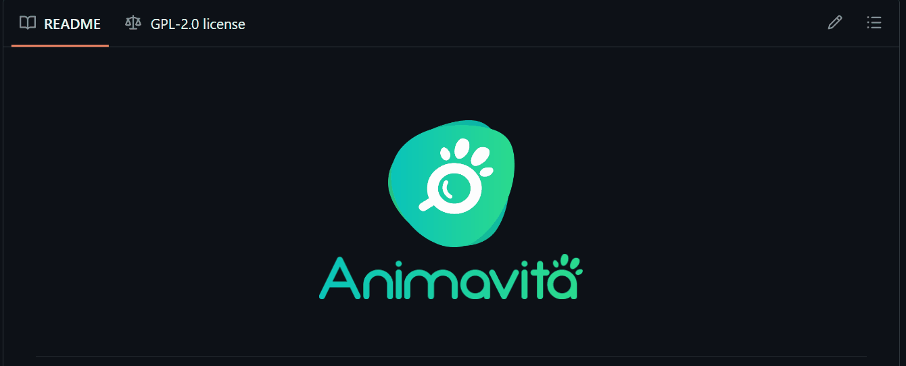

# Projeto com README
Um projeto teste com arquivo README 🚀

[]

## Tecnologias utilizadas
- HTML
- CSS
- JS
## Como utilizar

1 - Clone para o projeto
```
git clone <url>
```

2 - Acesse a pasta do projeto
```
cd repositorio-com-readme
```
